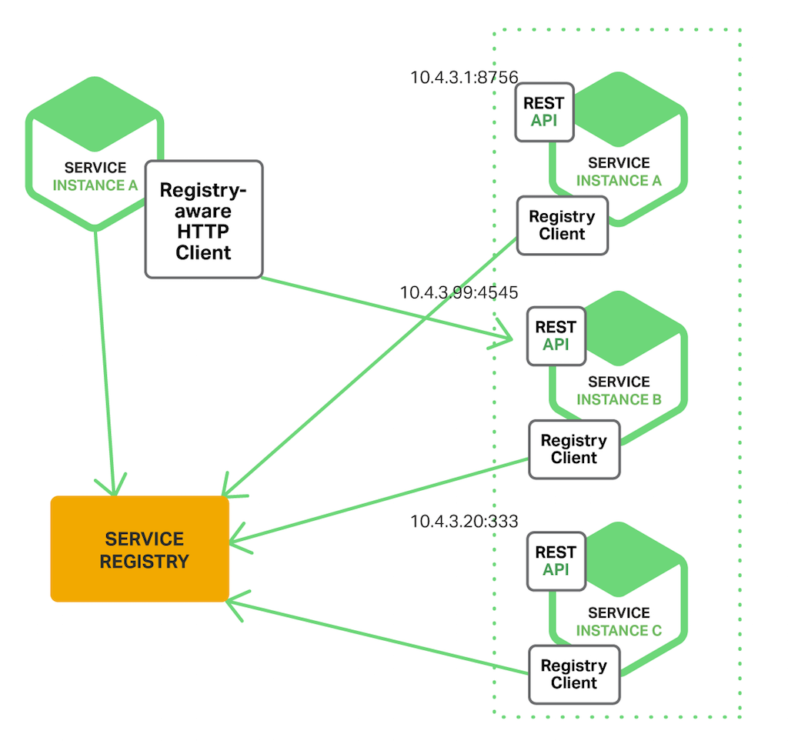

== Inter-process communication

In a microservices application, the required load can grow or shrink according on the demand. This means that the number of instances of a service can change at any time. This is a problem because the instances of a service need to communicate with each other. This is where inter-process communication (IPC) comes in.

IPC refers to the mechanisms used by different processes to communicate with each other. Here, we approach this subject within the context of a microservice architecture application. This is important because microservices are typically designed to be independently deployable and scalable, which means they are often deployed on different machines or in different locations. This makes IPC a critical component of application architectures.

=== Methods

There is a wide range of IPC mechanisms available, and each has its own advantages and disadvantages. Here, we will focus on the most popular ones, by category. We will also compare them in terms of their suitability for microservices architectures.

==== Synchonous communication

Synchronous communication is a type of communication where the sender service waits for a response from the invoker service before continuing. There are two main mechanisms for synchronous communication: REST and RPC.

===== REST

REST (Representational State Transfer) is a architectural style that defines a set of constraints to be used for creating Web services. RESTful Web services allow the requesting systems to access and manipulate textual representations of Web resources by using a uniform and predefined set of operations. RESTful Web services are stateless, which means that the server does not need to know anything about the state of the client that is making the request.

In the context of REST, a resource is a piece of data that can be accessed via a unique identifier, such as a URL. Resources are manipulated using a set of standard HTTP methods, such as GET, POST, PUT, and DELETE. These methods are used to retrieve, create, update, and delete resources, respectively.

REST APIs use HTTP as the communication protocol and can support a wide range of data formats, including JSON and XML. They are simple and lightweight, making them well-suited for use in microservices architectures.

Overall, REST is a widely used and well-established approach for building web services, and it is particularly well-suited for microservices because of its simplicity and flexibility.

Rest is guided by the 6 following principles:

- `Client-server`: The client and server are independent of each other. The two systems can be developed and deployed independently. A client should know only resource URIs, and that's all.
- `Stateless`: The server does not store any client context between requests. Each request from the client to the server must contain all the information necessary to understand the request, and the server must respond to that request as new.
- `Cacheable`: The server must indicate if a response can be cached or not. If a response is cacheable, then a client or a server side cache can store it and reuse it later, saving bandwidth and server resources.
- `Uniform interface`: The interface between the client and the server must be uniform. This means that the interface should be simple and intuitive. The interface should be independent of the underlying implementation.
- `Layered system`: The client should not be aware of the underlying layers of the system. The client should only be aware of the immediate layer with which it is communicating. For example, a client cannot ordinarily tell whether it is connected directly to the end server or an intermediary along the way.
- `Code on demand` (optional): The server can optionally return executable code to the client. This code can be used to extend the functionality of the client.

===== RPC

RPC (Remote Procedure Call) is a mechanism for a computer program to call and execute a procedure (subroutine) in another program, through the network. For a developer, the call is like a normal local procedure call, without any details for the remote interaction. The RPC mechanism make agnostic the developer about the language, the platform, the network, the operating system, etc.

RPC is used in microservices architecture applicaions to communicate between processes running on different computers over a network. As a procedure, RPC is a synchronous communication mechanism, which means that the sender service waits for a response from the invoker service before continuing.

gRPC is a modern, open source, high-performance remote procedure call (RPC) framework that can run in any environment. It can efficiently connect services with pluggable support for load balancing, tracing, health checking, and authentication.

By default, gRPC uses proto files to define services and messages. The following example shows a simple hello world service definition:

[source,proto]
----
// The greeter service definition.
service Greeter {
  // Sends a greeting
  rpc SayHello (HelloRequest) returns (HelloReply) {}
}

// The request message containing the user's name.
message HelloRequest {
  string name = 1;
}

// The response message containing the greetings
message HelloReply {
  string message = 1;
}
----

==== Asynchronous communication

Asynchronous communication is a type of communication where the sender service does not wait for a response from the invoker service before continuing. Let's speak about the most popular mechanisms for asynchronous communication : Message queues and Publish-subscribe.

===== Message queues

A message queue is a temporary storage area where messages are placed while waiting to be processed. Message queues are typically used to decouple the sender and receiver of a message, and to provide a buffer for the sender and receiver to handle the message. Here is a simple example of a message queue:

.Message queue simple example

In this example, the sender service sends a message to the message queue, and the receiver service reads the message from the queue. The sender and receiver services do not need to be running at the same time, and they do not need to know anything about each other. This decoupling makes message queues well-suited for microservices architectures.

Message queues are typically implemented using a queueing system, such as RabbitMQ, Apache ActiveMQ, or IBM MQ. These systems are typically deployed as a separate service, and they can be used by multiple applications.

===== Publish-subscribe (pub/sub)

Publish-subscribe is a messaging pattern where senders of messages, called publishers, do not program the messages to be sent directly to specific receivers, called subscribers. Instead, published messages are characterized into classes without knowledge of which subscribers, if any, there may be. Similarly, subscribers express interest in one or more classes and only receive messages that are of interest, without knowledge of which publishers, if any, there are. The message router, or message broker, is responsible for managing the information flow between publishers and subscribers.

The following diagram shows a simple example of a publish-subscribe system:

.Publish-subscribe simple example
image::images/Publish-subscribe simple example.png[align=center]

In this example, the publisher service publishes a message to the message broker, and the subscriber service subscribes to the message broker. The publisher and subscriber services do not need to be running at the same time, and they do not need to know anything about each other. This decoupling makes publish-subscribe well-suited for microservices architectures.

Publish-subscribe is typically implemented using a message broker, who is responsible for storing messages and delivering them to subscribers., such as Apache Kafka, Google pub/sub, AWS SNS or Redis pub/sub. These systems are typically deployed as a separate service, and they can be used by multiple applications.

=== Architecture patterns

In this section, we will see the most common patterns used to communicate between microservices.

==== API gateway

An API gateway is a single entry point for clients to access the functionality of a distributed application. The API gateway is responsible for routing requests to the appropriate microservice, and for aggregating the results. It works as a reverse proxy, and it can be used to implement security, rate limiting load balancing and other functionality.

The following diagram shows a simple example of an API gateway:

.API gateway

In this example, the API gateway is responsible for routing requests to the appropriate microservice, and for aggregating the results.

==== Circuit breaker

The circuit breaker pattern is a mechanism that allows a service to fail fast and recover quickly. It is used to prevent cascading failures in a distributed system. A circuit breaker is a state machine that can be in one of two states: closed or open. When the circuit breaker is closed, the service can be called. When the circuit breaker is open, the service cannot be called. The circuit breaker can be in the open state for a fixed amount of time, or it can be in the open state until a certain number of calls have been made.

The following diagram shows a simple example of a closed circuit breaker:

.Closed circuit breaker

In this example, the circuit breaker is closed, and the service can be called. Until the service succeeds, the circuit breaker remains closed.

The following diagram shows a simple example of an open circuit breaker:

.Open circuit breaker

In this example, the circuit breaker is open, and the service cannot be called. The circuit breaker will remain open for a fixed amount of time, or until a certain number of calls have been made. When the circuit breaker is open, the client receives an error message by the circuit breaker.

==== Bulkhead

The bulkhead pattern is a mechanism that allows a service to limit the number of concurrent connections it can handle. It is used to prevent cascading failures in a distributed system. It applies when multiple applications needs to connect to a component by requesting a connection to that component.

The following diagram shows a simple example of the bulkhead pattern:

.Bulkhead pattern

This pattern works as follows:

* A request for a wen connection is made.
* The bulkhead will check is the connection to the requested component is availiable to serve the request.
* If the connection is availiable, the bulkhead will serve the request.
* If the connection is not availiable, the bulkhead will wait for a pre-defined time interval.
* If any connection becomes availiable during this period, it will be allocated to serve the waiting request.
* If no connection becomes availiable during this period, the bulkhead return an exception.

==== Sidecar

The sidecar pattern is a mechanism that allows a service to add additional functionality to a microservice, such as logging, monitoring, or authentication. It is typically implemented as a separate process that runs alongside the microservice, such as a service proxy.

The following diagram shows a simple example of the sidecar pattern:

.Sidecar pattern
image::images/Sidecar pattern.png[align=center]

With this pattern, each microservice is composed of two parts: the microservice and the sidecar. When a request is made from or to the microservice, the sidecar intercepts the request and adds additional functionality, then forwards the request. Let's explain in detail how it works.

The following diagram shows the traffic flow when a request is made to the microservice, with a service proxy sidecar:

.Sidecar pattern - request to microservice
image::images/Sidecar pattern - request to microservice.png[align=center]

When a request is made to the microservice, the service proxy intercepts the request (and can adds additional functionalities), then forwards the request to the microservice. The microservice processes the request, and returns the response to the service proxy (and can too adds additional functionalities), which forwards it to the client.

==== Service mesh

A service mesh is a dedicated infrastructure layer for handling service-to-service communication. It works with a sidecar proxy that is deployed alongside each service. The sidecar proxy intercepts all network communication between microservices, and adds some functionnalities.

By this way, each microservice does not have to be coded with inter process communication logic, but only with the business logic. The service mesh is responsible for the inter process communication logic.

The most popular service mesh is Istio. It is an open source service mesh that provides traffic management, policy enforcement, and observability. Istio provide all following features:

* Secure service-to-service communication in a cluster with TLS encryption
* Strong identity-based authentication and authorization
* Automatic load balancing for HTTP, gRPC, WebSocket, and TCP traffic
* Fine-grained control of traffic behavior with rich routing rules, retries, failovers, and fault injection
* A pluggable policy layer and configuration API supporting access controls, rate limits and quotas
* Automatic metrics, logs, and traces for all traffic within a cluster, including cluster ingress and egress

Here is a schema of the Istio service mesh, with the envoy proxy sidecar:

.Istio service mesh

=== Service discovery

This part is principally based on the following article: https://www.nginx.com/blog/service-discovery-in-a-microservices-architecture/[Service Discovery in a Microservices Architecture]

Service discovery is the process of automatically detecting the location of a service. It is used to allow a service to find other services without having to know their location. This problem appeared because in microservice architecture, the different services are deployed on different servers, and the location of a service can change over time because of server failures, autoscaling or load balancing.

Service discovery is typically implemented using a service registry, such as Consul, etcd, or ZooKeeper. These systems are typically deployed as a separate service, and they can be used by multiple applications.

There is two main types of discovery patterns: Client-side and Server-side. Before explain those patterns, let's define what is a service registry.

==== Service registry

A service registry is a key part of service discovery. It's a database that contains the network location of all the services in a distributed system. He must be highly available. Some softwares implements this functionality, such as Consul, etcd, ZooKeeper, or Netflix Eureka.

Note that some systems such Kubernetes, Marathon and AWS have their own service registry implementation.

In those solutions, there are two common patterns for a service to register itself to the service registry: Self-registration and Third-party registration.

===== Self-registration

In self-registration, the service is responsible for registering and deregistering in the services register and can send heartbeat if necessary. This pattern is the most simple one and is used in many systems.

.Self-registration
image::images/Self-registration.png[align=center]

The real benefit of this pattern is its simplicity. You don't need any other system component.

===== Third-party registration

In third-party registration, a specific service is responsible to register all services in the service registry. This service is called a registrar. The registrar, implemented as a separate service, should be highly available.

.Third-party registration
image::images/Third-party registration.png[align=center]

The benefits of this pattern are:

* All services are decoupled from the service registry.
* A service does not have to implement register logic.

The main drawback of this pattern is that it requires an additional service, the registrar.

===== Consul

Let's see how Consul implements the service registry.

Consul is a service networking that offers some features. Here, we will speak about the service discovery feature, that allows to register services and to query them, in a kubernetes cluster. It is a third-party registration.

Consul is made up of two parts:

* `Consul server`: The consul server is made up of some server agents (a leader and some followers), that are responsible to store all services states. Consul follows the consensus protocol to ensure that all agents have the same state, and be fault tolerant.
* `Consul client node`: A consul client is made up of two parts: the consul client agent, that is responsible to register, deregister and query the services, and the proxy, that makes the bridge between the agent and the service. Generally, there is one consul client agent per consul client node. The consul client node can be a kubernetes node, or a VM.

The services does not need to know the location of the others services, and can query them using a domain name. The proxy is responsible to resolve the domain name to a service location, and to forward him the request.

Here is the schema of the service discovery with Consul:

.Service discovery with Consul

It is the basic functioning of Consul. In a kubernetes cluster, the consul client agent is not necessary, because the kubelet can replace it.

.Service discovery with Consul in a kubernetes cluster

In this schema, the consul server is deployed in a kubernetes cluster. The consul client agent is replaced a unique sidecar container, that is deployed in each pod. The sidecar container is responsible to register, deregister and query the services and is made up of two parts: a dataplane and a envoy proxy.

Consul uses the gossip protocol to share the services states between the client agents and the server agents. The gossip protocol is a peer-to-peer protocol, that means that each node is responsible to share the information with the others. Here is a schema of the gossip protocol:

.Gossip protocol with consul

Every few seconds, each consul client agent and server will send a heartbeat to one of its peers, chosen randomly. By this way, the global state of the cluster is shared between all nodes of the cluster. This protocol is based on UDP, so it is very efficient, and it is fault tolerant. It is also very scalable, and reduces the load on the network bandwidth.

==== Client-side discovery

In client-side discovery, the client is responsible for discovering the location of the other services by query the service registry. 

The following diagram shows a simple example of client-side discovery:

.Client-side discovery

in this schema, each service, once started, will register itself to the service registry.

The client will then query periodically the service registry to get availiable locations of the services. If a service is no longer available, the service register will delete its list of available services, then after the next periodic updating of the customer, it will no longer try to connect to this service.

==== Server-side discovery

In server-side discovery, the server (load balancer) is responsible for discovering the location of the other services by query the service registry. A load balancer is a server that distributes network or application traffic across a number of services.

The following diagram shows a simple example of server-side discovery:

.Server-side discovery
image::images/Server-side discovery.png[align=center]

In this schema, as well for the client-side discovery, each service, once started, will register itself to the service registry.

The load balancer will then query the service registry periodically to get availiable locations of the services. If a service is no longer available, the service register will delete its list of available services, then after the next periodic updating of the load balancer, it will no longer try to connect to this service.

The server-side discovery has several benefits:

* All details of service discovery is abstracted for the client.
* Client needs only to query one service, the load balancer, to query the required service.
* This pattern is more scalable than the client-side discovery.
* This pattern is easier to use because some softwares already implement this pattern (and for free), such as Nginx, HAProxy, Varnish, etc.

=== PolyCode integration

For our application, PolyCode, we have different types of microservices. There is the microservice cutting scheme presented in part 1 of this document.

.PolyCode microservice architecture schema

The five microservices are:

- `Mailer`
- `Authentication` (Keycloak)
- `Account`
- `Learning`
- `Runner`

In this part, we will see how we will manage the communication and the discovery between those microservices. Let's begin with the mailer microservice.

==== Mailer service communication

IMPORTANT: In the case of this exercise, we can't use a message queueing system, then we cannot consider the following proposition. In a real case, I think this is the best solution, that is why I present it here. You can skip this part if you want.

The mailer service is responsible to send emails to users or candidates. It is a service that is used by others. For example, when a user is invited in a team, the `Account` service will call the `Mailer` service to send the email.

This use case does not need a response from the `mailer`, because if a letter is not received, there is still a way to send it again. Especially since we would have no guarantee than the mail was well received and read.

Therefore, we will use asynchronous communication for this service. Since we only have this service that uses it, we will not use pub/sub pattern, but a simple queueing system.

In our previous example, the `Account` service will send a message to the event queue, and the `Mailer` service will consume this message, and send the email.

The benefits of this pattern are:

* The `Account` service does not have to wait for the `Mailer` service to send the email.
* The `Mailer` service can consume the messages in the queue at its own pace.
* We can scale the `Mailer` service easily by adding multiple consumers, depending on the queue size.

The drawbacks of this pattern are:

* If the scale is not well managed, the queue can grow indefinitely and cause some problems, and the mails will not be sent in a suitable time.

The chosen the queueing system RabbitMQ. There is no particular reason for this choice, except that it is the most widely deployed open source message broker.

Here is the schema of the `Mailer` microservice communication with RabbitMQ message broker:

.Mailer microservice communication
image::images/Mailer microservice communication.png[align=center]

==== Others services communication

For the other microservices, we will use synchronous communication. The reason is that we need a response from the service. For example, when a user query his profile data to the `Account` service, a call to the `Authentication` service is made to check token validity. In this case, we need a response before sending the data to the user.

For all our microservices, we will use a REST API. The reason is that it is a well-known pattern, and it is easy to use. We don't need to use a more complex protocol such as gRPC, because we don't need to optimize the communication between our microservices for now.

==== Service discovery

For the service discovery, we will use the third-party registration pattern. We will use the `Consul` service registry. The reason is that it is a well-known service registry. We will use the self-managed version of Consul (open source) with kubernetes, because the PolyCode application is not deployed in a cloud environment, but on private servers, at Polytech.

Here is the schema of the PolyCode service discovery with Consul:

.PolyCode service discovery with Consul

In this schema, we can see that each microservice is deployed in a kubernetes pod. Each pod has the microservice and a sidecar container, that is responsible to register, deregister and query the service. The sidecar container is made up of two parts: the dataplane and an envoy proxy. The envoy proxy is responsible to communicate with the service, and make load-balacing, and the dataplane with the consul control plane. The consul control plane is responsible to keep the global state of the cluster.