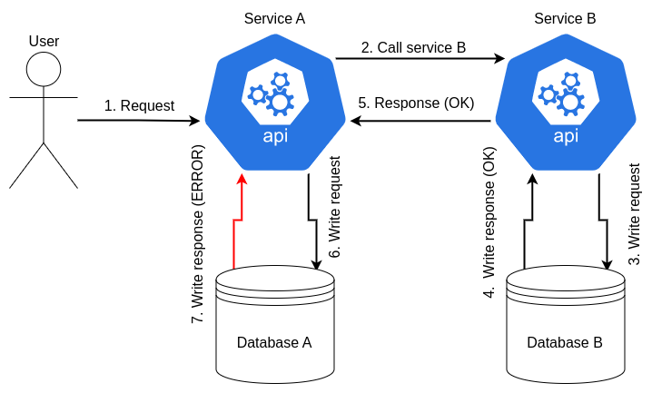

== Data Management

The data management concerns the way the database is managed, and how the data is stored. In microservice architecture, the microservices are independent, and they don't share the same database. Because of this, some new problems can appear and need to be solved. Let's see them, then how to solve them. After that, we will see how the microservice migration affects the data organization.

=== Data Consistency

In a traditional monolithic architecture, the data is stored in a single database, and it guarantees the data consistency by using transactions. In a microservice architecture, the data is stored in different databases, and it is not possible to use transactions. This means that the data consistency is not guaranteed.

Here is an example of a flow that cause a data inconsistency:

.Inconsistent Data

This problem is the most complex problem to solve in a microservice architecture, and can cause a lot of problems, such as data loss, or data corruption.

There are several ways to solve it, such as the Saga pattern, or the Event Sourcing pattern, but they are not allowed in our case. We can limit the problem by following some rules, like validate the data editing only after the resonse of all others services, but we can't solve it completely; A called service can edit data, and the caller service can fail before validating the data. This means that the data is not consistent between this two services.

The best we can do is manage data inconsistencies, which requires additional development.

=== Data Backup

An important part of data management is to backup the data. It is necessary to ensure that it is not lost. As said before, in a microservice architecture, the data is stored in different databases, and it is not possible to backup all the data at the same time. This means that it is necessary to backup each database separately.

The backup can be done in several ways, such as a snapshot, or a dump. The snapshot is a copy of the database at a specific time, and the dump is a copy of the database at a specific time, but in a sql file. The snapshot is faster, but the dump is more portable.

The problem here is again data consistency. We need to ensure that the backup is made at the same time for all databases, to ensure that the data is consistent. This can be done by using a tool, such as `pg_dumpall`, which is a tool to dump all databases at the same time, but it is not possible is your databases are not on the same instance.

=== PolyCode Data Migration

The PolyCode data organization changes is caused by the microservice migration. Here is the new data organization for all microservices: