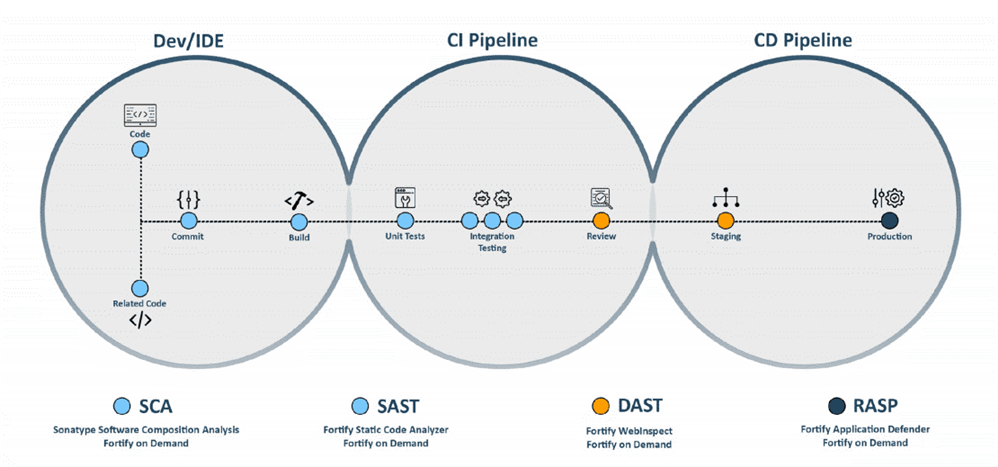
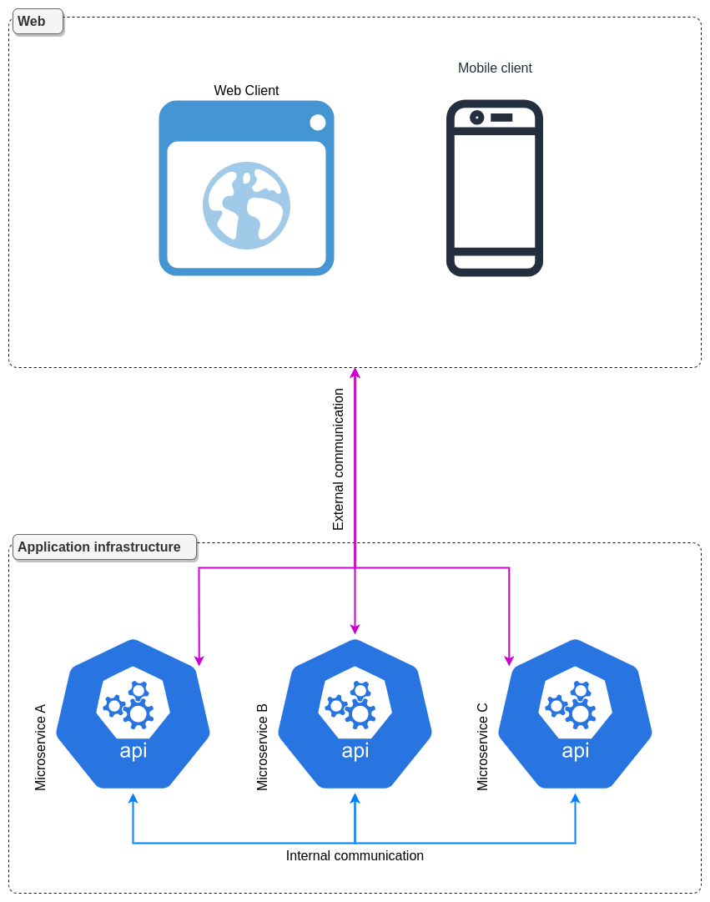
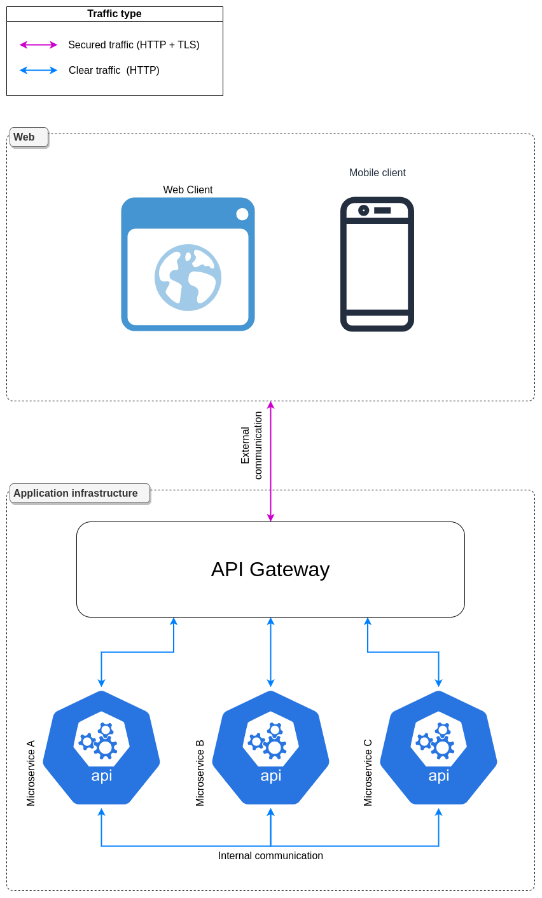
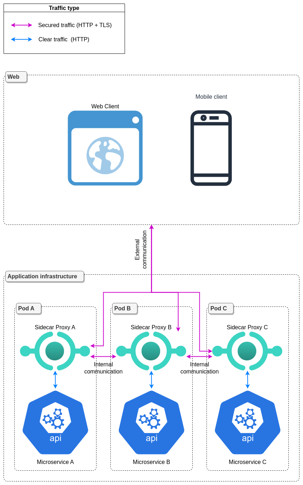
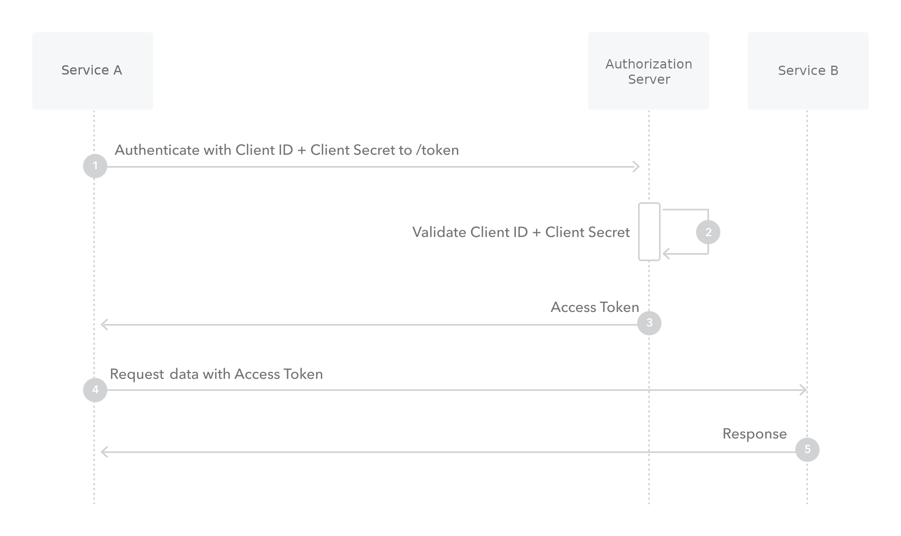
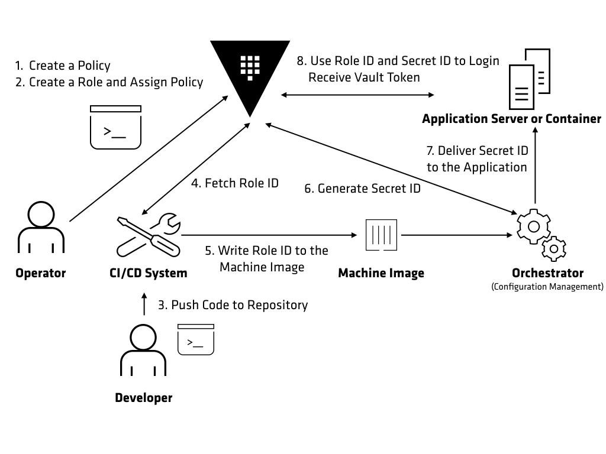

== Security

The security is a very important part in any software development, and that has always been.

In a microservice architecture, unlike a monolith, each service runs in its own process and may have its own unique security requirements. Additionally, because the services communicate with each other over the network, there is a greater risk of data breaches and other security incidents. Therefore, it is important to consider security as early as possible in the development process.

There is many ways to secure a microservice architecture, under several aspects. Here, we will try to cover the most important ones. You have to keep in mind that there is no ultimate solution, and you have to choose the right security solution for your specific needs.

=== Application level

The application security level concerns the code itself, and the way it is written. It is important to write secure code, and to follow the best practices. It is necessary to start that a developer will write code containing security failures. We cannot prevent this, but we can limit it in several ways. Let's see some of them.

==== Code Review

The code review is a very important part of the development process. It is a way to ensure that the code is written in a secure way, and that it follows the best practices. It is also a way to ensure that the code is written in a way that is easy to maintain, and that it is easy to understand. It is always good to have another point of view on written code.

Examination of the code can be carried out by someone in the same company, or by external developers, with security audits.

==== Dependency Analysis

Additionally, it is necessary to keep an eye on the dependencies used for the development of applications. 
security failures are frequently discovered, and security updates are then necessary.

There are tools to detect it automatically, such as Dependabot (GitHub), or Snyk.

==== Security Testing

Security testing is a way to ensure that the code written code works as expected. There are several ways to do it, and we will explain three of them.

===== Static application security testing (SAST)

SAST is a way to analyze the code statically, without executing it (only with the source code). It is a way to detect security failures in the code, and to ensure that the code follows the best practices. There are several tools to do it, such as Klocwork, or Checkmarx.

===== Dynamic application security testing (DAST)

DAST is a way to analyze the code dynamically, by executing it (without the source code). It is a way to detect security failures in the code, and to ensure that the code follows the best practices. Arachni, an open source tool, can be used for this purpose.

Here is a diagram showing where the SAST and DAST tests are done on the development process.

.SAST and DAST tests in the development process

===== Stress Testing

Stress testing is a way to test the code under heavy load. It is a way to ensure that the code can handle a large number of requests. There are several tools to do it, such as WebLoad, LoadNinja, or JMeter.

This type of testing is important, because there is no other way to test the resistance of an application against a huge load.

=== Communication level

The communication level concerns the way the services communicate with each other. In a microservice architecture, each microservice communication is done through the network.

There are two types of communication in a microservice architecture: internal communication and external communication. Here is a diagram showing those two different types.

.Internal and external communication in a microservice architecture

External communication is the communication between a microservice and the web. If a microservice is exposed to the web, it is strongly likely that he was attacked. Therefore, it is necessary to ensure that the communication between the microservice and the web is encrypted.

Internal communication is the communication between microservices. This communication is not exposed to the web, but it is still better to ensure that it is encrypted, if possible.

Let us first see what layers we can encrypt communication.

==== Gateway level

If you use a gateway, you can encrypt the communication between the gateway and the web. This is the most easy way to add encryption. You only have to add a TLS certificate to the gateway, then all the outgoing communication will be encrypted. Note that all internal communication will not be encrypted.

Here is a diagram showing the gateway level encryption:

.Gateway level encryption

Here, the gateway provide a TLS certificate to the web. The web will then be able to communicate with him in a secure way.

==== Sidecar level

You can also encrypt the communication between each microservice and the gateway (or the web, if you donc have a gateway). This is a more complex way, but it is also the most secure one.

Here is a diagram showing the sidecar level encryption:

.Sidecar level encryption

Here, each microservice have a sidecar that provide a TLS certificate. With this approach, all communication is encrypted (internal and external). The only exception is the communication between the sidecar and the microservice, but this communication is not exposed to any other network.

It's strongly recommended to use this approach, if possible.

==== Rate limiting

Rate limiting is a way to limit the number of requests that can be sent to a microservice. It is a way to prevent a service from being overloaded, or to prevent a service from being attacked, such as a DDoS attack, or a brute force attack.

There are several ways to do it, such as the Nginx rate limiting module, or the Envoy rate limiting module.

==== Service Authentication and Authorization

Service authentication and authorization is a way to ensure that only known and authorized services can communicate with each other.

===== Authentication

Authentication is a way to ensure that the service is known. Here, we will see how to authenticate a service using OAuth 2.0.

NOTE: You can refer to the authentication part of this document to see more details.

A service, such as a user, can authenticate himself to the authorization server, and get an access token to communicate with other services. In this case, it's the Client Credentials Grant type that is used.

Here is a sequence diagram of this flow:

.Client Credentials Flow

As you can see, this flow is very simple. Because the communication is encrypted, as explained in the previous section, the client secret is not exposed to the network.

===== Authorization

Authorization is a way to ensure that a known service has sufficient rights to communicate with another service. To do so, we will use the role based access control (RBAC) model.

This model is based on roles and permissions. A role is a set of permissions, and is assigned to a subject (can be a user, or a service). A permission is an action associated with a resource. For example, a subject can be assigned to the role named `admin`, who own the permission `read` on the resource `user`. This means that this subject can read the resource `user`.

With this model, we can apply the principle of least privilege. This principle is a way to ensure that a subject can only do what he needs to do. It is better to have a problem of lack of permissions, and to have to add it, rather than an excess of not necessary rights.

Generally, the authorization server is the one that will check the permissions of a subject.

=== Data Security

The data security concerns the way the data is stored. This is an extremely important part, because it is the most important asset of a company, and can cause a lot of problems about privacy, or even financial problems if they are stolen.

It is necessary to encrypt the sensitive data as much as possible.

First of all, all passwords must be hashed, and that with a strong salt. Basically, this is already done by the authentication server, which is the one that stores the passwords.

To encrypt the sensitive data (who needs to be read, not as a password), the cloud provider can provide a way to do it, or if you manage your own database, you can use its feature (if it exists).

The cons of this approach is that it is not possible to search in this data, and the encryption and decryption process can be very slow.

=== Secrets Management

Secrets are sensitive data, such as passwords, tokens, certificates, etc. It is necessary to manage them correctly, and to ensure that they are not leaked. There are several ways to do it.

In a microservice architecture, we need to centralize the secrets management, to ensure that all services have the same secrets, and get them from a secure way, so that they are not leaked. There is some solutions to do it, like HashiCorp Vault, Azure Key Vault, or Kubernetes Secrets.

Here, because the chosen solution to PolyCode is HashiCorp Vault, we will explain how it works.

==== HashiCorp Vault

HashiCorp Vault is a tool for securely storing and accessing secrets. It provides a centralized platform for managing sensitive information. Vault can also be used to generate dynamic credentials for services and applications, and to control access to those secrets through role-based access controls.

Here is a diagram showing the flow of HashiCorp Vault:

.HashiCorp Vault flow

As you can see, a service can get the secrets from Vault, using its own credentials. Vault will then check if the service is authorized to get the secrets with the RBAC, and if it is, it will return them.

=== PolyCode Integration

For PolyCode, we will use some of the solutions explained before:

* `TLS everywhere`: We will use the sidecar level encryption, as explained before. This will ensure that all communication is encrypted, and that the data can't be intercepted.
* `Service Authentication and Authorization` : We will use the Client Credentials Grant type, with our own Keycloak authorisation server, describe in the authentication part. This will ensure that only known services can communicate with each other.
* `Service Authorization`: Additionally, we will use the RBAC model, to ensure that the service can only do what it needs to do.
* `Data Encryption`: We will hash the passwords. For the other data, we will not encrypt them, because it will be too complicated and not necessary for now.
* `Secrets Management`: We will use HashiCorp Vault, to manage the secrets.
