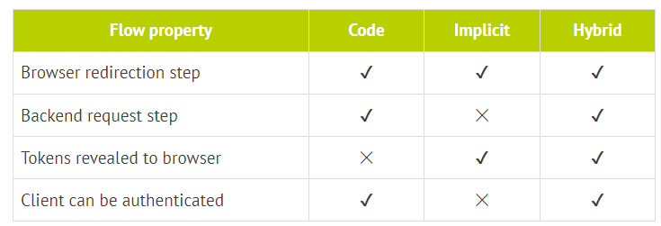
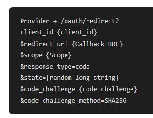
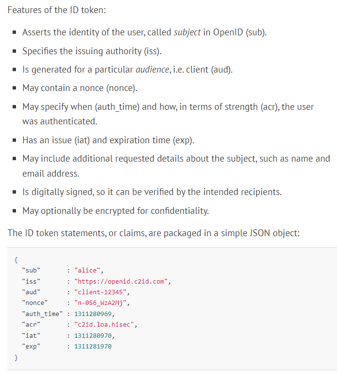
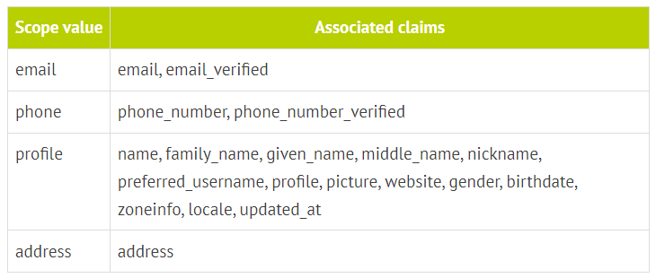
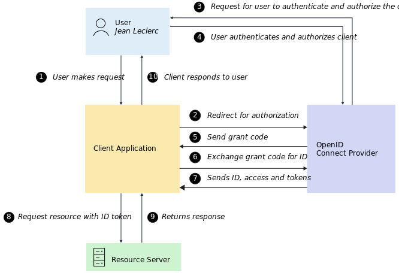

= TAD
:toc:
:toclevels: 5
:toc-title: Sommaire

== Question 2

=== Oauth 2.0

https://blog.postman.com/pkce-oauth-how-to/[good explain + source of images] +
https://www.youtube.com/watch?v=YdShQveywpo[devoxx video] +
https://www.youtube.com/watch?v=t18YB3xDfXI[deuxième vidéo]

==== Terminologies

Protected resource: the data +
Resource server: that know the protected resource +
Authorization server: that know the account credentials +
Client: that want your data +
Resource owner: you +
Redirect URI: url the authorization server back to after login (callback url) +
Response type: most common = code, but for an implicit grant type response_type=token (liste) +
Scope: read/etc on a resource +
Consent: the popup that prompt to user to agree data sharing +
Client ID: delivered by the authorization server, he is used to identify the client +
Client Secret: only client and auth server know to communicate securely (its a hash so after sending it  nobody can get it again) +
Authorization Code: short lived temporary code the auth server send back to the client to exchange for an access token +
Access token: key the client use to call the resource server and get data +

==== Flow

.test

===== Authorization code flow

image::images/image2.png[]

===== Implicit flow

In implicit flow, the authorization server return directly the token (response_type=token). This method is not secure.

image::images/image12.png[]

===== Hybrid flow

Same as implicit flow, but when the authorization server authorize the user, he call the token server that generate and send to you the token

==== Refresh token

image::images/image3.png[]

==== Permissions

// TODO ?

==== LDAP vs CAS
CAS is a protocol to authenticate users. It is used by many applications. +
Lightweight Directory Access Protocol (LDAP) is a protocol for accessing and maintaining distributed directory information services over an Internet Protocol (IP) network. +

=== Oauth 2.1 [In progress]

https://fusionauth.io/learn/expert-advice/oauth/differences-between-oauth-2-oauth-2-1#:~:text=OAuth%202.1%20is%20not%20a,a%20reference%20document%20going%20forward[Source] +
Consolidated by 8 years of best practices in Oauth 2.0
Any new features +
Change list : +
1. PKCE +
2. Compare the redirect client uri with exact maching pattern +
3. The implicit flow is removed +
4. Resource Owner Password Credentials grant is omitted (because client have the user credentials with this method) +
5. Bearer token usage now requires the use of the HTTP Authorization header (instead of uri) +
6. Limit refresh tokens : must either be sender-constrained or one-time-use +

=== PKCE (Proof Key for Code Exchange)

https://www.loginradius.com/blog/engineering/pkce/[Source] +
It’s an overcoat of the oauth2 protocol when you ask for an access token.

==== Terminologies

Code Verifier: huge random string, between 43 and 128 characters +
Code challenge: BASE64-URL-encoded string of the SHA256 hash of the code verifier

Those informations are given to authorization server at the first query. When the client ask for a new token, he send to the authorization server the client id and the code verifier. The authorization server then hash the code verifier and compare it to the code challenge. If they match, the authorization server send back the access token.

image::images/image13.png[]

Then you can get access tokens like this:

image::images/image5.png[]

=== OpenID Connect (OIDC)

https://www.ibm.com/docs/en/cics-ts/6.1?topic=cics-openid-connect[Source IBM (smallest)] +
https://connect2id.com/learn/openid-connect[Source]

Adding to Oauth2, this provides more information about the resource owner. It’s like JWT (Json Web Token). +
Use to make SSO (Single Sign On) = One login to use multiple others APIs = Give to user better experience because prevent for massive account creation

=== SSO

Single sign-on (SSO) is an authentication method that enables users to securely authenticate with multiple applications and websites by using just one set of credentials. // TODO perhaps to develop

=== JWT

https://www.ibm.com/docs/en/cics-ts/6.1?topic=cics-json-web-token-jwt[Source IBM]

==== Anatomy

image::images/image6.png[]

==== Claims

https://openid.net/specs/openid-connect-core-1_0.html#StandardClaims[Standards claims]

Ask specific claim

image::images/image9.png[]

==== Flow

1. The user makes a request to the client application.
2. The client application redirects the request to the OpenID Connect Provider (OP) for authorization.
3. The OP sends an authentication and authorization request to the user.
4. The user authenticates and authorizes the client application to access the resource.
5. The OP sends a grant code to the client application.
6. The client application sends a request to the OP to exchange the grant code for an ID token (in the form of a JWT), an access token, and a refresh token.
7. The OP sends the ID token (JWT), access token, and refresh token to the client application.
8. The client application makes the request to the resource server with the JWT, which is used to authenticate the user and to authorize access to the resource.
9. The response is sent from the resource server to the client application.
10. The response is sent from the client application to the user.

==== Endpoints

https://connect2id.com/learn/openid-connect#endpoints[endpoints]

image::images/image11.png[]

=== Tools

==== KeyCloak

===== Migration

==== Okta

==== Auth0

==== FusionAuth

==== AWS Cognito
